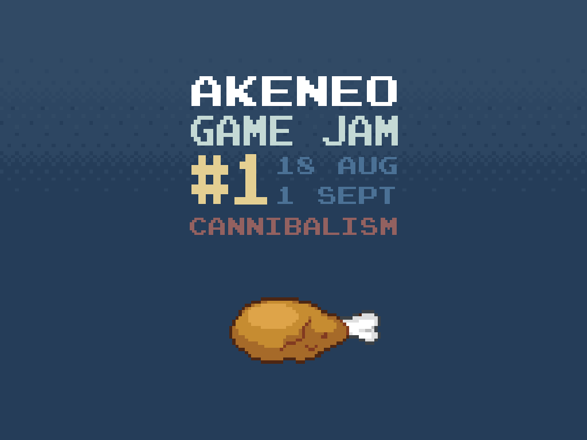

# Mr. Chang

Small game quickly developed for the Akeneo Game Jam #1.
So.. crappy code & roughly coded, but here it is :p

# Demo

Note: All game text are in french, sorry.

You can access to the demo here http://www.grena.fr/mr-chang/

The goal is to wait for your food, and notice if a restaurant client stays
in the kitchen... If still in the kitchen, don't eat your food!

# Install

Just fork the repo, no middleware to run.

# Run

Open `index.html` in your browser.

# Artwork and special thanks

TODO
